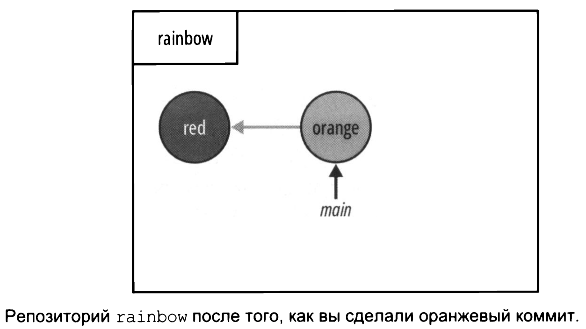

# Ветки
<br>
Перед началом зафиксируем состояние репозитория. На данный момент он выглядит так.  
<br>  

   
<br>
Если состояние представить в виде диаграммы репозитория то он будет выглядеть следующим образом.  
<br>  

   
<br>

Смысл существования и использование веток в git:  
* возможность работать над одним и тем же проектом по-разному;  
* возможность нескольким людям работать над одним проектом.  
<br>  

**Ветка в git** - перемещаемый указатель на коммиты.  
```bash
user@WIN-CVKT899RCS2 MINGW64 ~
$ cd desktop/rainbow    # отправляемся в директорию проекта

user@WIN-CVKT899RCS2 MINGW64 ~/desktop/rainbow (master)
$ git log                
commit 8702e14a31d6cedf2c281b084a9b68dd9c087e95 (HEAD -> master) # ветка в круглых скобка это ветка, указывающая на этот коммит, в данном случа название ветки это 'master'

Author: user <**************@yandex.ru>
Date:   Mon Nov 18 20:29:06 2024 +0700

    red color
```
<br>  

   

***прим*** - на скриншотах вместо ```master``` будет указано ```main```.  

<br>

## Измененные и неизмененные файлы 
В рабочем каталоге файлы могут находиться в двух состояниях:  
* Неизмененные файлы: Это файлы, которые не редактировались с момента последнего коммита. Например, если файл rainbowcolors.txt не изменялся, он считается неизмененным.  
* Измененные файлы: Когда файл редактируется и изменения сохраняются в текстовом редакторе, он становится измененным. Важно отметить, что Git распознает изменения только после их сохранения.

Таким образом, если вы не сохранили изменения в редакторе, Git будет считать файл неизмененным.  
<br>  

Команда ```git status``` фактически показывает список всех измененных файлов и сообщает, были ли они добавлены в промежуточную область. Однако она не перечисляет файлы, оставшиеся без изменений.   
<br>  

```шаг - 1```  
```bash
user@WIN-CVKT899RCS2 MINGW64 ~/desktop/rainbow (master)
$ git status
On branch master    # На ветке master
nothing to commit, working tree clean    # нет ничего для коммита, рабочее дерево пустое
```
<br>  

```шаг - 2```  
Теперь добавим в файл ```rainbowcolors.txt``` следующий текст - "Оранжевый - второй цвет радуги." и сохраним файл. И снова выполним команду ```git status```.  
<br>  

```шаг - 3```  
```bash
user@WIN-CVKT899RCS2 MINGW64 ~/desktop/rainbow (master)
$ git status     
On branch master    # на ветке master
Changes not staged for commit:    # есть изменения не подготовленные для коммита
  (use "git add <file>..." to update what will be committed)    # используйте "git add <file>..." для обновления содержимого коммита
  (use "git restore <file>..." to discard changes in working directory)    # используйте git restore <file>..." для отмены изменений в рабочем каталоге 
        modified:   rainbowcolors.txt    # изменен rainbowcolors.txt

no changes added to commit (use "git add" and/or "git commit -a")    # никаких изменений не добавлено в коммит (используйте "git add" и/или "git commit -a")
```
<br>  

*Обсудим*  
* на шаге 1 ```rainbowcolors.txt``` является неизмененным, следовательно ```git status``` о нем ничег оне сообщает
* на шаге 3 ```rainbowcolors.txt``` уже изменен, мы добавили в него запись. ```git status``` теперь показывае файл в выводе
* файл ```rainbowcolors.txt``` не подготовлен для коммита, т.е. он не был добавлен в промежуточную область
<br>

Добавим ```rainbowcolors.txt``` в промежуточную область, чтобы его можно было включить в следующий коммита и снова вызовем ```git status``` для обзора изменений отоюражения.  
```bash
user@WIN-CVKT899RCS2 MINGW64 ~/desktop/rainbow (master)
$ git add rainbowcolors.txt    # добвляем файл в промежуточную область

user@WIN-CVKT899RCS2 MINGW64 ~/desktop/rainbow (master)
$ git status    # вызываем git status
On branch master    # на ветке мастер
Changes to be committed:    # изменения для включения в коммит
  (use "git restore --staged <file>..." to unstage)    # (используйте "git restore --staged <.file> ..." для отмены)
        modified:   rainbowcolors.txt    # изменен rainbowcolors.txt
```
```rainbowcolors.txt``` - включен в промежуточную область, подготовлен для коммита.  
<br>  

## Второй коммит
Выплняем команду ```git commit -m```.  
```bash
user@WIN-CVKT899RCS2 MINGW64 ~/desktop/rainbow (master)
$ git commit -m "Orage color"
[master 837aa1e] Orage color
 1 file changed, 2 insertions(+), 1 deletion(-)    # (1 файл изменен, 2 вставки(+), 1 удаление(-))
```
<br>  

Посмотрим теперь на результат вывода команды ```git log```.  
```bash
user@WIN-CVKT899RCS2 MINGW64 ~/desktop/rainbow (master)
$ git log
commit 837aa1e0a2803f21581156843c14a390a5594c16 (HEAD -> master)
Author: user <*********@yandex.ru>
Date:   Tue Nov 19 20:50:28 2024 +0700

    Orage color

commit 8702e14a31d6cedf2c281b084a9b68dd9c087e95
Author: user <*********@yandex.ru>
Date:   Mon Nov 18 20:29:06 2024 +0700

    red color
```
<br>  

* сделали новый коммит - "Orange color", хеш коммита - 837aa1e0a2803f21581156843c14a390a5594c16
* текст ```(HEAD -> master)``` теперь рядом с оранжевым коммитом
<br>  

   
  
* появился второй коммит ```Orange```      
* ```Orange``` указывает на ```red```   
* ветка ```master``` указывает на ```Orange```  
<br>


