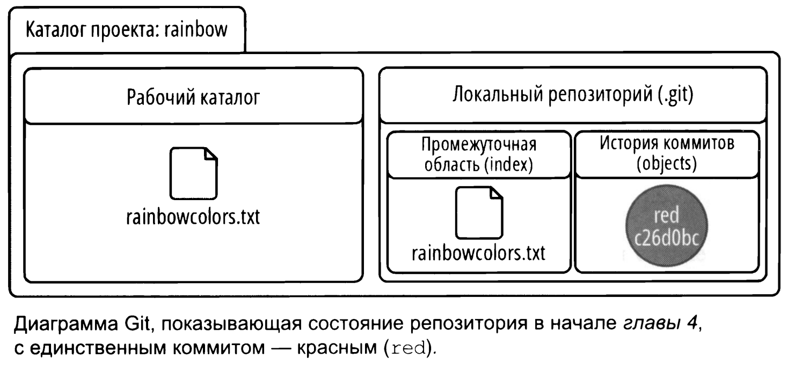
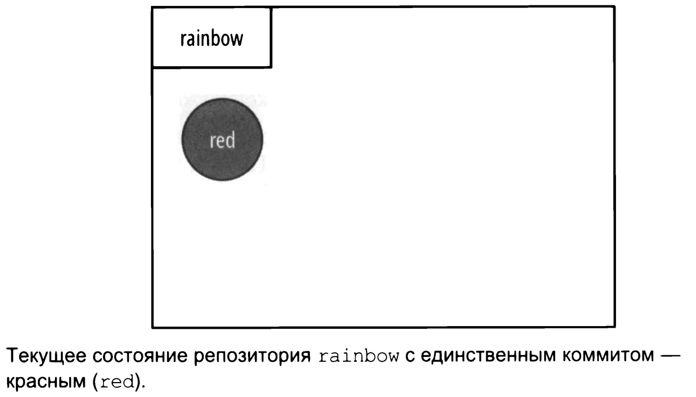
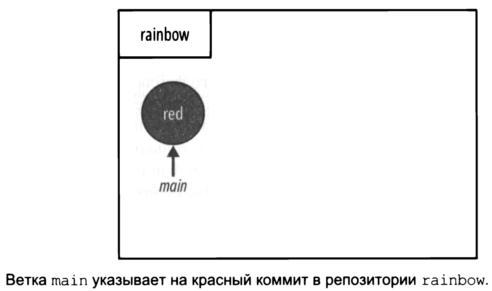

# Ветки
<br>
Перед началом зафиксируем состояние репозитория. На данный момент он выглядит так.  
<br>  

   
<br>
Если состояние представить в виде диаграммы репозитория то он будет выглядеть следующим образом.  
<br>  

   
<br>

Смысл существования и использование веток в git:  
* возможность работать над одним и тем же проектом по-разному;  
* возможность нескольким людям работать над одним проектом.  
<br>  

**Ветка в git** - перемещаемый указатель на коммиты.  
```bash
user@WIN-CVKT899RCS2 MINGW64 ~
$ cd desktop/rainbow    # отправляемся в директорию проекта

user@WIN-CVKT899RCS2 MINGW64 ~/desktop/rainbow (master)
$ git log                
commit 8702e14a31d6cedf2c281b084a9b68dd9c087e95 (HEAD -> master) # ветка в круглых скобка это ветка, указывающая на этот коммит, в данном случа название ветки это 'master'

Author: user <**************@yandex.ru>
Date:   Mon Nov 18 20:29:06 2024 +0700

    red color
```
<br>  

   

***прим*** - на скриншотах вместо ```master``` будет указано ```main```.  

<br>
