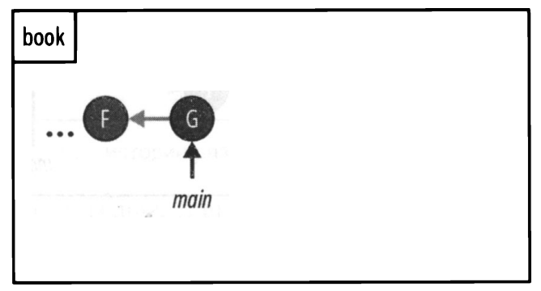
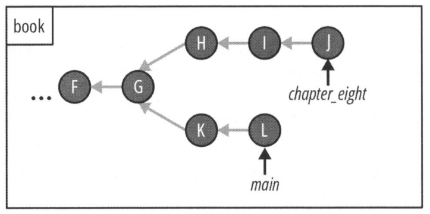
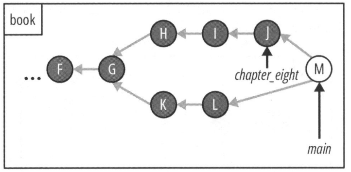
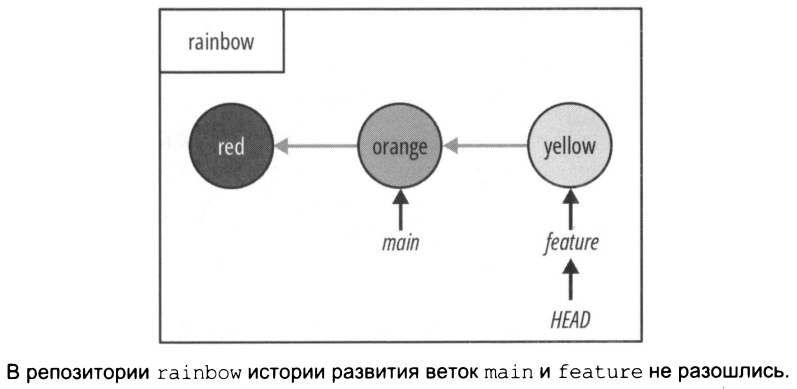
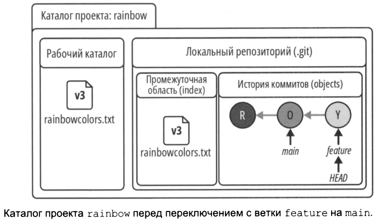
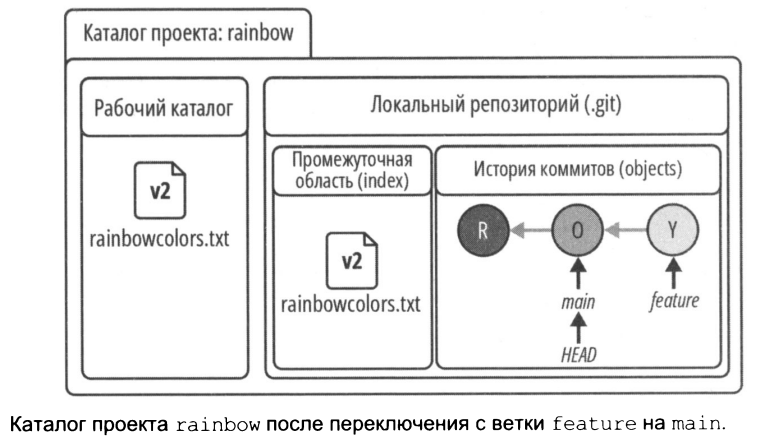
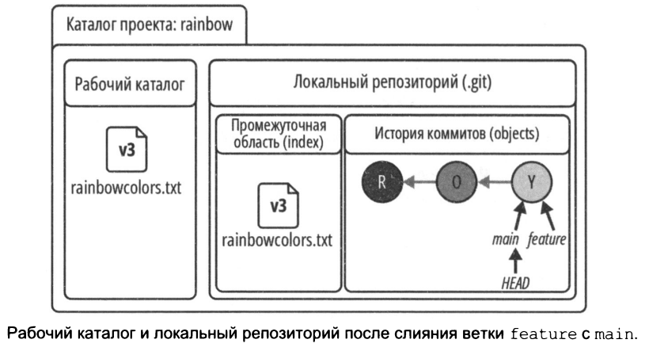
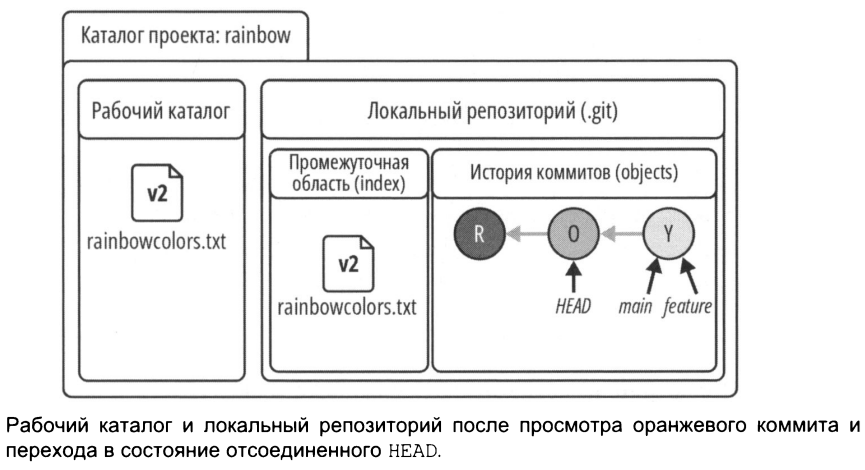
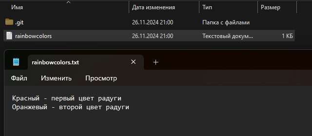

# Слияния

Текущее состояние репозитория.  
<br>
   
<br>

## Сливние
Слияние ```merge``` в Git представляет собой метод интеграции изменений из одной ветки в другую. В процессе слияния существует две ветки: ```исходная ветка``` (source branch), из которой берутся изменения, и ```целевой ветка``` (target branch), в которую эти изменения встраиваются. Исходная ветка содержит все нововведения, которые будут добавлены в целевую ветку. В результате операции слияния изменения применяются только к целевой ветке, что приводит к её обновлению.   
<br>  

Существует два типа слияний:  
• ускоренные слияния;  
• трехсторонние слияния.   
<br>  

## Ускоренное слияние  

```Ускоренное слияние``` — это разновидность слияния, которое происходит в том случае, если истории веток, участвующих в процессе, не расходятся. Иными словами, это возможно, когда можно добраться до целевой ветки, следуя по родительским ссылкам в истории коммитов исходной ветки. В процессе ускоренного слияния Git просто перемещает указатель целевой ветки на коммит исходной ветки.  
<br>  

   
<br>  

Если я прослежу родительские ссылки ветки master назад, то обнаружу, что она включает коммиты A и B. Это означает, что история ветки master состоит из этих двух коммитов. В то же время история ветки chapter_six охватывает коммиты A, B, C, D и E.    
Если мы можем достичь одной ветки, прослеживая историю коммитов другой ветки, это означает, что их истории не разошлись. Например, если я прослежу родительские ссылки из ветки chapter_six, указывающей на коммит E, назад, я доберусь до ветки main, которая ссылается на коммит B. Таким образом, можно утверждать, что ветки main и chapter_six не разошлись.  
<br>  

   
<br>  

Если бы я сейчас объединил ветку chapter_six с веткой master, это привело бы к ускоренному слиянию. В процессе ускоренного слияния указатель ветки master переместится вперед и начнет указывать на коммит, соответствующий ветке chapter_six, то есть на коммит E. В этом примере chapter_six является исходной веткой, а master — целевой. Указатель ветки master просто переместился вперед с коммита B на коммит E. Именно поэтому такие слияния часто называют ускоренной перемоткой вперед (fast-forward merge).

## Трехстороннее слияние  
Трехстороннее слияние происходит в тех случаях, когда истории веток, участвующих в процессе, расходятся. Истории считаются расходящимися, когда невозможно добраться до целевой ветки, следуя истории коммитов исходной ветки. В такой ситуации, при объединении исходной ветки с целевой, Git выполняет трехстороннее слияние, создавая коммит слияния для соединения двух историй разработки. После этого указатель целевой ветки перемещается на созданный коммит слияния.  
<br>  

Предположим, что последние два коммита в ветке main моего репозитория book - это коммиты F и G.  
<br>  

   
<br>

Теперь предположим, что я решила создать ветку chapter _ eight для работы над главой 8 моей книги и делаю коммиты Н, I и J. Однако в то же время я вношу некоторые изменения в ветку main, и теперь она указывает на коммит L.  
<br>  

   
<br>  

На рисунке вы можете видеть, что история разработки ветки chapter _ eight состоит из коммитов F, G, Н, I и J. С другой стороны, история ветки main состоит из коммитов F, G, К и L. Невозможно пройти по родительским ссылкам (представленным серыми стрелками) ветки chapter _ eight назад, чтобы достичь коммита, на который указывает ветка main, т. е. коммита L. В этой ситуации мы говорим, что истории развития веток разошлись.  
<br>  

Если я захочу объединить ветку chapter _ eight с веткой main, это не может быть быстрым слиянием, потому что невозможно просто переместить указатель ветки вперед, чтобы объединить эти две истории разработки. Вместо этого будет создан коммит слияния (назовем его коммитом М), чтобы связать две истории разработки вместе Коммит слияния - это коммит, имеющий более одного родителя. Он служит примером трехстороннего слияния (three-way merge). 
<br>  

   
<br> 

Коммит М указывает на коммиты J и L. Причина, по которой этот вид слияния называется трехсторонним, заключается в том, что для выполнения слияния Git рассматривает два коммита, на которые указывают ветки, участвующие в слиянии (в случае репозитория book это коммиты J и L), а также коммит, который является общим предком этих двух коммитов, которым в данном случае является коммит G. Вот почему слияние "трехстороннее".   

## Выполнение ускоренного слияния  
Для отработки ускоренного слияния выполним сливние ветом master и feature.   
master - целевая;  
feature - исходная.  
<br>  

На диаграмме коммита видно, что до ветки master можно добраться из ветки feature - значит будет ускоренное сливяние.
<br>  

   
<br> 

Процесс слияния состоит из двух этапов:
1. Переключитесь на ветку, в которую вы хотите выполнить слияние (целевую ветку - master).
2. Введите команду git merge и передайте ей имя объединяемой ветки (исходная ветка - feature).

Переключение веток меняет файлы в рабочем каталоге  
<br>  

 
Как в данный момент выглядят различные области каталога проекта rainbow. Версия файла rainbowcolors.txt в рабочем каталоге и промежуточной области - это версия, в которой упоминаются красный, оранжевый и желтый цвета. Она представлен как версия 3 (vЗ).   
<br>    
<br>    
  
   
<br>  

```bash
user@WIN-CVKT899RCS2 MINGW64 ~/desktop/rainbow (feature)
$ git log #  запрашиваем лог
commit 065e138db25198f6a1fdafa2d7c8f0d977ad9c0d (HEAD -> feature)  # видим, что находимся в ветке feature, в ней 3 коммита: красный, оранжевый и желтый
Author: user <korablinr22@yandex.ru>
Date:   Fri Nov 22 22:38:57 2024 +0700

    Yellow

commit 837aa1e0a2803f21581156843c14a390a5594c16 (master)
Author: user <korablinr22@yandex.ru>
Date:   Tue Nov 19 20:50:28 2024 +0700

    Orage color

commit 8702e14a31d6cedf2c281b084a9b68dd9c087e95
Author: user <korablinr22@yandex.ru>
Date:   Mon Nov 18 20:29:06 2024 +0700

    red color

user@WIN-CVKT899RCS2 MINGW64 ~/desktop/rainbow (feature)
$ git switch master  # переключаемся на ветку master
Switched to branch 'master'

user@WIN-CVKT899RCS2 MINGW64 ~/desktop/rainbow (master)
$ git log  # запрашиваем лог ветки master
commit 837aa1e0a2803f21581156843c14a390a5594c16 (HEAD -> master)  # видим, что теперь мы на ветке master, в которой всего два коммита. Красный и оранжевый
Author: user <korablinr22@yandex.ru>
Date:   Tue Nov 19 20:50:28 2024 +0700

    Orage color

commit 8702e14a31d6cedf2c281b084a9b68dd9c087e95
Author: user <korablinr22@yandex.ru>
Date:   Mon Nov 18 20:29:06 2024 +0700

    red color
```
<br>  

Сама по себе команда ```git log``` показывает лишь список коммитов в выбраной HEAD ветви. Для того чтобы посомтреть весь список коммитов нужно пероедать дополнительный аргумент ```git log --all```.  

```bash

user@WIN-CVKT899RCS2 MINGW64 ~/desktop/rainbow (master)
$ git log --all
commit 065e138db25198f6a1fdafa2d7c8f0d977ad9c0d (feature)
Author: user <korablinr22@yandex.ru>
Date:   Fri Nov 22 22:38:57 2024 +0700

    Yellow

commit 837aa1e0a2803f21581156843c14a390a5594c16 (HEAD -> master)
Author: user <korablinr22@yandex.ru>
Date:   Tue Nov 19 20:50:28 2024 +0700

    Orage color

commit 8702e14a31d6cedf2c281b084a9b68dd9c087e95
Author: user <korablinr22@yandex.ru>
Date:   Mon Nov 18 20:29:06 2024 +0700

    red color
```
<br>  

Выполним слияние. Находясь в целевой ветке ```master``` выполним команду ```git merge <имя>```.  
```bash
user@WIN-CVKT899RCS2 MINGW64 ~/desktop/rainbow (master)
$ git merge feature
Updating 837aa1e..065e138  # обновление (указан хэш коммита)
Fast-forward  # ускоренное слияниек
 rainbowcolors.txt | 3 ++-
 1 file changed, 2 insertions(+), 1 deletion(-)  # один изменен, две вставки, одно удаление
```
<br>  

```bash
user@WIN-CVKT899RCS2 MINGW64 ~/desktop/rainbow (master)
$ git log
commit 065e138db25198f6a1fdafa2d7c8f0d977ad9c0d (HEAD -> master, feature)
Author: user <*********@yandex.ru>
Date:   Fri Nov 22 22:38:57 2024 +0700

    Yellow

commit 837aa1e0a2803f21581156843c14a390a5594c16
Author: user <*********@@yandex.ru>
Date:   Tue Nov 19 20:50:28 2024 +0700

    Orage color

commit 8702e14a31d6cedf2c281b084a9b68dd9c087e95
Author: user <*********@@yandex.ru>
Date:   Mon Nov 18 20:29:06 2024 +0700

    red color
```
<br>  

Обсудим:  
* вывод ```git log``` говорит о том, что ```master``` указывает на желтый коммит;
* вы объединили ветку feature с веткой main, но она все еще существует, поскольку не была удалена автоматически.
<br>    
  
   
<br> 

## Проверка коммитов после слияния

```bash
user@WIN-CVKT899RCS2 MINGW64 ~/desktop/rainbow (master)
$ git checkout 837aa1e0a2803f21581156843c14a390a5594c16
Note: switching to '837aa1e0a2803f21581156843c14a390a5594c16'.

You are in 'detached HEAD' state. You can look around, make experimental
changes and commit them, and you can discard any commits you make in this
state without impacting any branches by switching back to a branch.

(Вы находитесь в состоянии отсоединенного HEAD. Вы можете осмотреться, внести экспериментальные изменения и зафиксировать их,
а также отменить любые коммиты, сделанные в этом состоянии, не
затрагивая ни одну ветку, переключившись обратно на ветку.)

If you want to create a new branch to retain commits you create, you may
do so (now or later) by using -c with the switch command. Example:

  git switch -c <new-branch-name>

(Если вы хотите создать новую ветку для сохранения созданных вами
коммитов, вы можете сделать это (сейчас или позже), используя -с
с командой switch.

Пример:
git switch -с <имя_ новой_ ветки>

Or undo this operation with:

  git switch -

(Или отменить эту операцию с помощью:
... )

Turn off this advice by setting config variable advice.detachedHead to false

Для отключения этого совета задайте переменной конфигурации
advice.detachedHead значение false) 


HEAD is now at 837aa1e Orage color
```
<br>  

```bash
user@WIN-CVKT899RCS2 MINGW64 ~/desktop/rainbow ((837aa1e...))
$ git log --all
commit 065e138db25198f6a1fdafa2d7c8f0d977ad9c0d (master, feature)
Author: user <korablinr22@yandex.ru>
Date:   Fri Nov 22 22:38:57 2024 +0700

    Yellow

commit 837aa1e0a2803f21581156843c14a390a5594c16 (HEAD)
Author: user <korablinr22@yandex.ru>
Date:   Tue Nov 19 20:50:28 2024 +0700

    Orage color

commit 8702e14a31d6cedf2c281b084a9b68dd9c087e95
Author: user <korablinr22@yandex.ru>
Date:   Mon Nov 18 20:29:06 2024 +0700

    red color
```
<br>  

Обсудим:  
* на шаге 1 выходные данные ```git checkout``` сообщают вам, что вы находитесь в состоянии отсоединенного HEAD 'detached HEAD';  
* на шаге 3 выходные данные ```git log``` сообщают, что **HEAD** теперь указывает на оранжевый коммит;  
* версия файла rainbowcolors.txt в вашем рабочем каталоге - это версия, которая является частью оранжевого коммита, где упоминаются только красный и оранжевый цвета (представленные версией v2).

<br>    
  
   
<br>  
<br>    
  
   
<br>  

