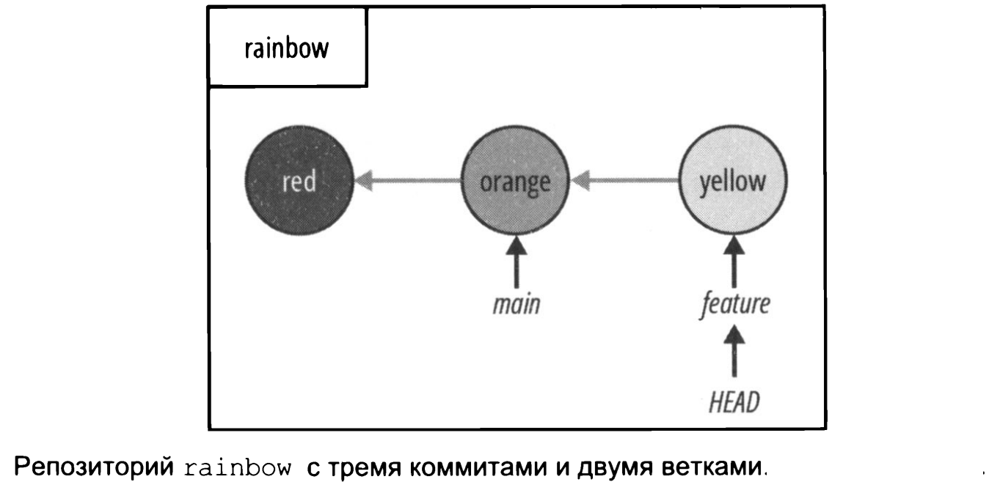
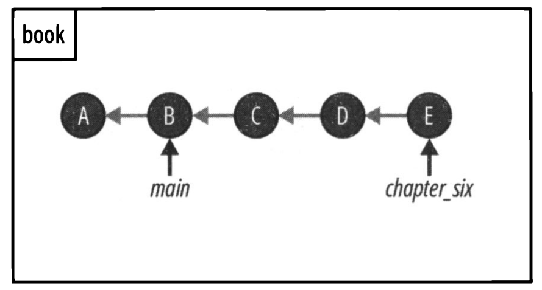
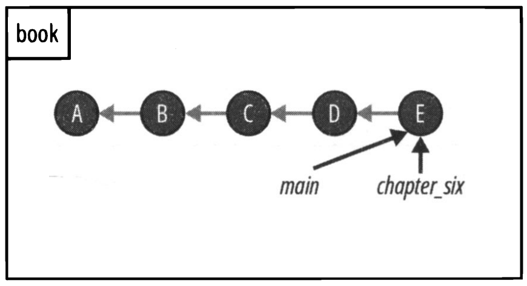

# Слияния

Текущее состояние репозитория.  
   
<br>

## Сливние
Слияние ```merge``` в Git представляет собой метод интеграции изменений из одной ветки в другую. В процессе слияния существует две ветки: ```исходная ветка``` (source branch), из которой берутся изменения, и ```целевой ветка``` (target branch), в которую эти изменения встраиваются. Исходная ветка содержит все нововведения, которые будут добавлены в целевую ветку. В результате операции слияния изменения применяются только к целевой ветке, что приводит к её обновлению.   
<br>  

Существует два типа слияний:  
• ускоренные слияния;  
• трехсторонние слияния.   
<br>  

## Ускоренное слияние  

```Ускоренное слияние``` — это разновидность слияния, которое происходит в том случае, если истории веток, участвующих в процессе, не расходятся. Иными словами, это возможно, когда можно добраться до целевой ветки, следуя по родительским ссылкам в истории коммитов исходной ветки. В процессе ускоренного слияния Git просто перемещает указатель целевой ветки на коммит исходной ветки.  
<br>  

   
<br>  

Если я прослежу родительские ссылки ветки master назад, то обнаружу, что она включает коммиты A и B. Это означает, что история ветки master состоит из этих двух коммитов. В то же время история ветки chapter_six охватывает коммиты A, B, C, D и E.    
Если мы можем достичь одной ветки, прослеживая историю коммитов другой ветки, это означает, что их истории не разошлись. Например, если я прослежу родительские ссылки из ветки chapter_six, указывающей на коммит E, назад, я доберусь до ветки main, которая ссылается на коммит B. Таким образом, можно утверждать, что ветки main и chapter_six не разошлись.  
<br>  

   
<br>  

Если бы я сейчас объединил ветку chapter_six с веткой master, это привело бы к ускоренному слиянию. В процессе ускоренного слияния указатель ветки master переместится вперед и начнет указывать на коммит, соответствующий ветке chapter_six, то есть на коммит E. В этом примере chapter_six является исходной веткой, а master — целевой. Указатель ветки master просто переместился вперед с коммита B на коммит E. Именно поэтому такие слияния часто называют ускоренной перемоткой вперед (fast-forward merge).
