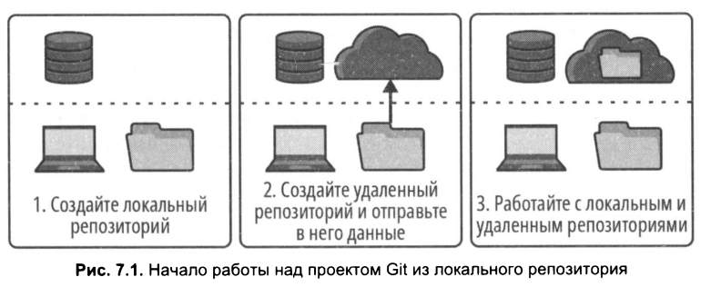
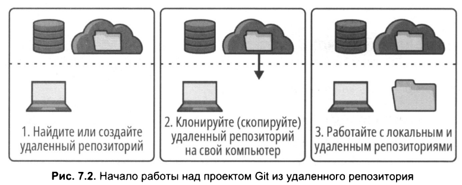

# Начало работы из локального репозитория  

## Начало работы с проектом Git из локального репозитория  

Создание локального репозитория:  
* Используйте команду ```git init``` для инициализации локального репозитория на вашем компьютере.   
* Сделайте хотя бы один коммит, чтобы сохранить изменения.  
  
Создание удаленного репозитория:   
* Создайте удаленный репозиторий на выбранном хостинге (например, GitHub, GitLab и т.д.).
   
Загрузка данных в удаленный репозиторий:    
* Используйте команду git push для отправки изменений из локального репозитория в удаленный.  
<br>  

   
<br>

## Начало работы с проектом Git из удаленного репозитория  

Выбор удаленного репозитория:  
* Найдите существующий удаленный репозиторий, с которым хотите работать, или создайте новый удаленный репозиторий на хостинге (например, GitHub, GitLab и т.д.).
  
Клонирование удаленного репозитория:  
* Используйте команду ```git clone <URL>``` для копирования удаленного репозитория на ваш компьютер. Это создаст локальный репозиторий с полным содержимым удаленного.   
<br>  

   
<br>

## Взаимодействие между локальными и удаленными репозиториями 

Локальные и удаленные репозитории действуют независимо. Когда дело доходит до работы с ними, важно понимать, что никакое взаимодействие между ними не происходит автоматически. Другими словами, никакие обновления из локального репозитория не будут автоматически поступать в удаленный репозиторий, и наоборот, никакие обновления из удаленного репозитория не будут автоматически поступать в локальный репозиторий. Между ними нет живой связи. Любые изменения в любом репозитории будут результатом явного выполнения ваших команд.   

## Создание удаленного репозитория   

Во время создания удаленного репозитория на сервере хостинга вы даете ему имя проекта удаленного репозитория, а служба хостинга предоставляет URL-aдpec удаленного репозитория. В этот адрес автоматически включается имя проекта удаленного репозитория. Служба хостинга сгенерирует для вашего репозитория два URL-aдpeca- для доступа по протоколам SSH и HTTPS.
Вам понадобится адрес для того протокола, который вы выбрали ранее.   
Процесс создания удаленного репозитория полностью выполняется на сайте хостинга.   

### Шаги по создани удаленного репозитория:  
1) войти в учетную запись хостинга;
2) создать удаленный репозиторий:
   * выбрать имя репозитория;
   * выбрать видимость публичный или частный;
   * поскольку в него будет пушиться локальный репозиторий не создавайте readme.md или .gitignore, нужен пустой репозитоий;
   * если нужно указать имя ветки можно выбрать main или оставить пустым.
3) копируйте URL репозитория.

После завершения всех шагов у нас есть пустой удаленный репозиторий.  
