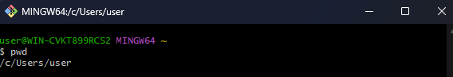
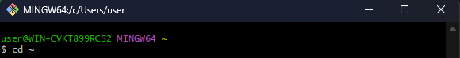
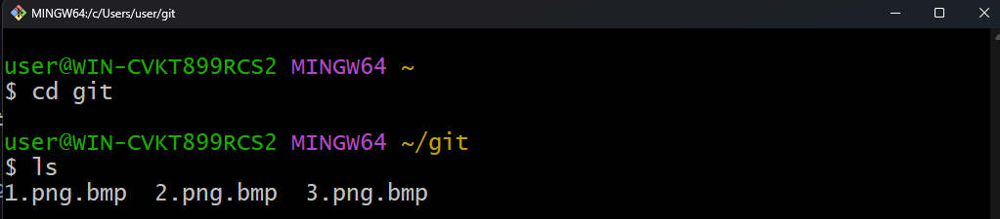
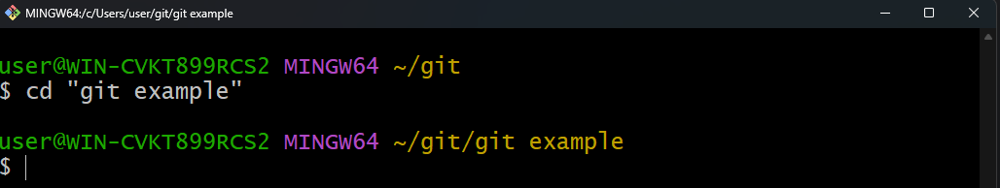

# GIT
## Командная строка

После запуска GIT Bash на экране будет отображено нечто в этом роде.


### $
```$``` символ означает, что программа ждет ввода команды.  
  
### pwd - где я?  
```pwd``` команда покажет ваше местоположение в данный момент.  
  
*(от англ. print working directory — «показать рабочую папку»)*  



```bash
user@WIN-CVKT899RCS2 MINGW64 ~
$ pwd
/c/Users/user  
```

  
```
Важно!
Операционные системы Windows, Linux и macOS имеют разные файловые системы.
* Windows: пути начинаются с буквы диска, например, C:.
* Linux: нет букв дисков; домашняя директория — /home.
* macOS: использует папку /Users, но также не имеет букв дисков.
```

### cd ~ домой
```cd ~``` пернет вас в домашнюю директорию, и не забудьте про символ ```~```, обозначающий домашнюю директори.  

*(от англ. change directory — «сменить директорию»)*   



```bash
user@WIN-CVKT899RCS2 MINGW64 ~
$ cd ~
```

## Навигация в командной строке
### ls - вывести содержимое директории
*(от англ. list directory contents — «отобразить содержимое директории»)*  

  

```bash
user@WIN-CVKT899RCS2 MINGW64 ~
$ cd git

user@WIN-CVKT899RCS2 MINGW64 ~/git
$ ls
1.png.bmp  2.png.bmp  3.png.bmp
```

### cd - сменить директорию
*(от англ. change directory — «сменить директорию»)*   

```
Важно!
если в названии папки есть пробелы, при вводе нужно использовать кавычки.
```
  


```bash
user@WIN-CVKT899RCS2 MINGW64 ~/git
$ cd "git example"

user@WIN-CVKT899RCS2 MINGW64 ~/git/git example
$
```

Чтобы вернуться на урвоень выше нужно использовать ```..``` - две точки.  

  

```bash
user@WIN-CVKT899RCS2 MINGW64 ~/git/git example
$ pwd
/c/Users/user/git/git example      -- сейчас мы здесь

user@WIN-CVKT899RCS2 MINGW64 ~/git/git example
$ cd ..                            -- используем ..

user@WIN-CVKT899RCS2 MINGW64 ~/git
$ pwd
/c/Users/user/git                  -- перешли на уровень выше
```
