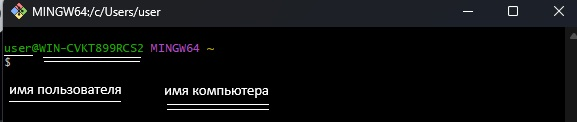

# GIT
## Командная строка

После запуска GIT Bash на экране будет отображено нечто в этом роде.


### $
```$``` символ означает, что программа ждет ввода команды.  
___
<br>

## Навигация в командной строке
### pwd - где я?  
```pwd``` команда покажет ваше местоположение в данный момент.  
  
*(от англ. print working directory — «показать рабочую папку»)*  

```bash
user@WIN-CVKT899RCS2 MINGW64 ~
$ pwd
/c/Users/user  
```
  
```
Важно!
Операционные системы Windows, Linux и macOS имеют разные файловые системы.
* Windows: пути начинаются с буквы диска, например, C:.
* Linux: нет букв дисков; домашняя директория — /home.
* macOS: использует папку /Users, но также не имеет букв дисков.
```
___
<br>

### cd ~ домой
```cd ~``` пернет вас в домашнюю директорию, и не забудьте про символ ```~```, обозначающий домашнюю директори.  

*(от англ. change directory — «сменить директорию»)*   

```bash
user@WIN-CVKT899RCS2 MINGW64 ~
$ cd ~
```
___
<br>

### ls - вывести содержимое директории
*(от англ. list directory contents — «отобразить содержимое директории»)*  

```shell
user@WIN-CVKT899RCS2 MINGW64 ~
$ cd git

user@WIN-CVKT899RCS2 MINGW64 ~/git
$ ls
1.png.bmp  2.png.bmp  3.png.bmp
```
<br>  

Просмотр скрытых файлов в директории.
ls с опцией -a

```ls```
```bash
user@WIN-CVKT899RCS2 MINGW64 ~
$ ls
 AppData/
'Application Data'@
 Budget.ipynb
 Contacts/
...
```
<br>

```ls -a```
```bash
user@WIN-CVKT899RCS2 MINGW64 ~
$ ls -a
 ./            <- скрытые файлы и директории отображены с точкой
 ../
 .anaconda/
 .bash_history 
 .conda/
 .condarc
 .continuum/
 .idlerc/
 .ipynb_checkpoints/
 .ipython/
 .jupyter/
 .matplotlib/
 .virtual_documents/
 AppData/

```
___
<br>

### cd - сменить директорию
*(от англ. change directory — «сменить директорию»)*   

```
Важно!
если в названии папки есть пробелы, при вводе нужно использовать кавычки.
```
```bash
user@WIN-CVKT899RCS2 MINGW64 ~/git
$ cd "git example"
```  

Чтобы вернуться на урвоень выше нужно использовать ```..``` - две точки.  

```bash
user@WIN-CVKT899RCS2 MINGW64 ~/git/git example
$ pwd
/c/Users/user/git/git example      -- сейчас мы здесь

user@WIN-CVKT899RCS2 MINGW64 ~/git/git example
$ cd ..                            -- используем ..

user@WIN-CVKT899RCS2 MINGW64 ~/git
$ pwd
/c/Users/user/git                  -- перешли на уровень выше
```

Чтобы обратиться к текущей директории, например, для запуска скрипта нужно использовать символ точки ```.``` - одна точка.

```bash
user@WIN-CVKT899RCS2 MINGW64 ~/git
$ pwd
/c/Users/user/git                  -- сейчас мы здесь

user@WIN-CVKT899RCS2 MINGW64 ~/git
$ cd .                             -- используем точку

user@WIN-CVKT899RCS2 MINGW64 ~/git
$ pwd
/c/Users/user/git                  -- ничего не изменилось
```

Символ ```/``` позволяет перемещаться сразу через несколько директорий.  

```bash
user@WIN-CVKT899RCS2 MINGW64 ~/git
$ cd ~                            -- идем "домой"

user@WIN-CVKT899RCS2 MINGW64 ~
$ pwd
/c/Users/user                     -- проверяем где мы

user@WIN-CVKT899RCS2 MINGW64 ~
$ cd git/"git example"            -- идем через 2 директории используя '/'

user@WIN-CVKT899RCS2 MINGW64 ~/git/git example
$ pwd
/c/Users/user/git/git example     -- снова првоеряем где мы

```
___
<br>

### ls - дополнительные возможности  

У многих команд консоли есть дополнительные опции. Например, если вы вызовете ```ls```, то увидите список обычных файлов в директории. Но можно вызвать ```ls``` с флагом ```-a``` и вывести расширенный список.  


```bash
$ ls # вывели список файлов
file.txt
photo.png

$ ls -a # вывели список, в котором отображаются скрытые файлы ., .. и .git
.
..
.git
file.txt
photo.png
```
А ещё, как и другие команды, ```ls``` может работать с символом домашней директории ```(~)``` и предыдущей директории ```(..)```. Например, ```ls ~``` выведет содержимое домашней директории вне зависимости от того, что показывает ```pwd```. А ```ls ..``` покажет содержимое родительской директории.   

  
```bash
user@WIN-CVKT899RCS2 MINGW64 ~/git/git example
$ pwd
/c/Users/user/git/git example          # где мы сейчас

user@WIN-CVKT899RCS2 MINGW64 ~/git/git example
$ ls
Folder/  Text.txt.txt  image.bmp.bmp   # список файлов в текущей директории

user@WIN-CVKT899RCS2 MINGW64 ~/git/git example
$ ls ..                                # вернем содержимое вышестоящей директории не меняя текущую
 1.png.bmp   2.png.bmp   3.png.bmp  'git example'/
```
___
<br>

## Операции с папками и файлами

### touch - создать файл

```bash
user@WIN-CVKT899RCS2 MINGW64 ~
$ cd git                              # отправляемся в папку git

user@WIN-CVKT899RCS2 MINGW64 ~/git
$ ls                                  # получаем список содержимого дериктории git
 1.bmp   2.bmp   3.bmp  'git example'/

user@WIN-CVKT899RCS2 MINGW64 ~/git
$ touch new_text.ttx                  # используя touch создаем нвоый файл 

user@WIN-CVKT899RCS2 MINGW64 ~/git
$ ls                                  # получаем снова список файлов, видим, что новый файл в директории
 1.bmp   2.bmp   3.bmp  'git example'/   new_text.tx

```
___
<br>

### mv - переименовать файл/директорию
*(от англ. move — «двигать, перемещать»)*   
Синтаксис ``` mv старое имя файла новое имя файла или папки ```  

```bash
user@WIN-CVKT899RCS2 MINGW64 ~/git
$ ls                                # поулчаем список содержимого, видим, что в файле new_text.ttx допущена ошибка в расширении
 1.bmp   2.bmp   3.bmp  'git example'/   new_text.ttx

user@WIN-CVKT899RCS2 MINGW64 ~/git
$ mv new_text.ttx new_text.txt      # переименуем файл используя mv 

user@WIN-CVKT899RCS2 MINGW64 ~/git
$ ls                               # снова возвращаем содержимое директории и првоеряем, что ошибка устранена 
 1.bmp   2.bmp   3.bmp  'git example'/   new_text.txt

```
___
<br>

### rm - удалить файл  
*(от англ. remove — «удалить»)*  
Синтаксис ``` rm имя файла для удаления ```   

```bash
user@WIN-CVKT899RCS2 MINGW64 ~/git
$ ls                                  # возвращаем список файлов
 1.bmp   2.bmp   3.bmp  'git example'/   new_text.txt

user@WIN-CVKT899RCS2 MINGW64 ~/git
$ rm new_text.txt                     # удалим файл используя rm

user@WIN-CVKT899RCS2 MINGW64 ~/git
$ ls                                  # проверяем, файл успешно удален
 1.bmp   2.bmp   3.bmp  'git example'/

```
___
<br>

### mkdir - создать директорию  
*(от англ. make directory — «создать директорию»)*   

```bash

user@WIN-CVKT899RCS2 MINGW64 ~/git
$ pwd                                # првоеряем где мы находимся
/c/Users/user/git

user@WIN-CVKT899RCS2 MINGW64 ~/git
$ ls                                 # возвращаем содержимое текущей директории   
 1.bmp   2.bmp   3.bmp  'git example'/

user@WIN-CVKT899RCS2 MINGW64 ~/git
$ mkdir new_folder                    # создадим новую папку используя mkdir

user@WIN-CVKT899RCS2 MINGW64 ~/git
$ ls                                  # првоеряем, новая папка создана
 1.bmp   2.bmp   3.bmp  'git example'/   new_folder/
```

Можно создать целую структуру директорий одной командой с помощью флага ```-p```.
```bash
user@WIN-CVKT899RCS2 MINGW64 ~/git
$ pwd                                  # првоеряем где мы
/c/Users/user/git

user@WIN-CVKT899RCS2 MINGW64 ~/git
$ ls                                   # возвращаем содержимое директории
 1.bmp   2.bmp   3.bmp  'git example'/   new_folder/

user@WIN-CVKT899RCS2 MINGW64 ~/git
$ mkdir -p folder_1/folder_2/folder_3  # создаем структуру директорий

user@WIN-CVKT899RCS2 MINGW64 ~/git
$ ls                                   # проверяем, структура создана
 1.bmp   3.bmp      'git example'/
 2.bmp   folder_1/   new_folder/
```
___
<br>

### rmdir - удалить пустую директорию
*(от англ. remove directory — «удалить директорию»)*   
```
Важно!
rmdir удаляет только пустые папки.
Для удаления директорий с содержимым используется rm -r
```
<br>

```bash

user@WIN-CVKT899RCS2 MINGW64 ~/git  # находимся в директории git
$ ls                                # получаем содержимое текущей директории
 1.bmp   2.bmp   3.bmp   folder/  'git example'/   new_folder/

user@WIN-CVKT899RCS2 MINGW64 ~/git
$ rmdir new_folder                  # удаляем папку

user@WIN-CVKT899RCS2 MINGW64 ~/git
$ ls                                # првоеряем, папка удален
 1.bmp   2.bmp   3.bmp   folder/  'git example'/

```
___
<br>

### rm -r - удалить не пустую директорию
*(от англ. remove — «удалить»)*   
```bash

user@WIN-CVKT899RCS2 MINGW64 ~/git
$ ls                                # возвращаем список файлов в директории
 1.bmp   2.bmp   3.bmp   folder/  'git example'/

user@WIN-CVKT899RCS2 MINGW64 ~/git
$ rmdir folder                      # пытаемся удалить папку и поулчаем ошибку  
rmdir: failed to remove 'folder': Directory not empty

user@WIN-CVKT899RCS2 MINGW64 ~/git
$ rm -r folder                      # использум для удаления rm -r 

user@WIN-CVKT899RCS2 MINGW64 ~/git
$ ls                                # проверяем, директория с содержимым удалена
 1.bmp   2.bmp   3.bmp  'git example'/
```
___
<br>

### Еще про создание файлов и папок
Команды ```touch``` и ```mkdir``` по умолчанию создают файлы и папки в текущей рабочей директории.
<br>

Создание папки или файла в отличной от текущей директории
```bash 
user@WIN-CVKT899RCS2 MINGW64 ~/git
$ cd ~                              # возвращаемся в домашнюю директорию

user@WIN-CVKT899RCS2 MINGW64 ~
$ pwd                               # проверяем, где мы находимся  
/c/Users/user

user@WIN-CVKT899RCS2 MINGW64 ~
$ touch git/test_file.txt           # создаем в директории git файл test_file.txt

user@WIN-CVKT899RCS2 MINGW64 ~
$ cd git                            # идем в директорию git 

user@WIN-CVKT899RCS2 MINGW64 ~/git
$ ls                                # получаем список содержимого, видим,созданный файл 
 1.bmp   3.bmp    'git example'/
 2.bmp   fodler/   test_file.txt
```
<br>

Создание файла с использованием двух точек - ```..```, т.е. на уровень выше.
```bash

user@WIN-CVKT899RCS2 MINGW64 ~/git
$ mkdir -p level_1/level_2/level_3      # создаем структуру вложенных папок     

user@WIN-CVKT899RCS2 MINGW64 ~/git
$ cd level_1/level_2/level_3            # отправляемся в папку с именем level_3

user@WIN-CVKT899RCS2 MINGW64 ~/git/level_1/level_2/level_3
$ touch ../../test_file_2.txt           # создаем файл на два уровня выше в текущей струткре

user@WIN-CVKT899RCS2 MINGW64 ~/git/level_1/level_2/level_3
$ cd ../../                             # отправляемся на два уровня вверх по струтктуре 

user@WIN-CVKT899RCS2 MINGW64 ~/git/level_1
$ ls                                    # вохвращаем содержимое папки level_1 и видим созданный файл
level_2/  test_file_2.txt
```
<br>

Создание файла или папки в домашней директории.
```bash
user@WIN-CVKT899RCS2 MINGW64 ~/git/level_1
$ mkdir ~/TEST_FOLDER                   # используя ~/ через mkdir создадим папку в домашней директории 

user@WIN-CVKT899RCS2 MINGW64 ~/git/level_1
$ cd ~                                  # отправлдяемся в домашнюю директорию

user@WIN-CVKT899RCS2 MINGW64 ~
$ ls                                    # првоеряем содержимое домашней директории, видим созданную папку

...
 TEST_FOLDER/
...
```
___
<br>

### cp - копирование файлов и папок
*(от англ. copy — «копировать»)*   
Синтаксис ```что копируем и куда копируем``` 
<br>  

Копирвоание файла ```cp```
```bash
user@WIN-CVKT899RCS2 MINGW64 ~
$ cd git       # из домашней директории отправляем в папку git

user@WIN-CVKT899RCS2 MINGW64 ~/git
$ ls           # возвращаем список содержимого директории git
 1.bmp   2.bmp   3.bmp   folde   folder/  'git example'/   level_1/   test_file.txt

user@WIN-CVKT899RCS2 MINGW64 ~/git
$ cp test_file.txt folder            # копируем файл test_file.txt в папку folder

user@WIN-CVKT899RCS2 MINGW64 ~/git
$ cd folder                          # отправляемся в папку folder

user@WIN-CVKT899RCS2 MINGW64 ~/git/folder
$ ls                                 # возвращаем содержимое папки и видим наш скопированный файл 
test_file.txt
```
<br>

Копирвоание папки ```cp -r```
```bash
user@WIN-CVKT899RCS2 MINGW64 ~/git
$ ls                               # возвращаем содержимое такущей директории                           
1.bmp  2.bmp  3.bmp  folder/  new_folder/  test_file.txt

user@WIN-CVKT899RCS2 MINGW64 ~/git
$ cp -r folder/ new_folder/        # скопируем папку folder/ в new_folder/

user@WIN-CVKT899RCS2 MINGW64 ~/git
$ cd new_folder/                   # отправляемся в new_folder/

user@WIN-CVKT899RCS2 MINGW64 ~/git/new_folder
$ ls                               # видим там нашу скопированную папку
1.bmp  folder/
```
<br>

Множественное копирвоание 
```bash
user@WIN-CVKT899RCS2 MINGW64 ~/git  <- тут тоже видно где мы сейчас
$ pwd               # проверяем где мы сейчас 
/c/Users/user/git

user@WIN-CVKT899RCS2 MINGW64 ~/git
$ ls                # возвращаем содержимое 
1.bmp  2.bmp  3.bmp  folder/  new_folder/  test_file.txt

user@WIN-CVKT899RCS2 MINGW64 ~/git
$ mkdir images      # создадим папку для наших изображений

user@WIN-CVKT899RCS2 MINGW64 ~/git
$ ls                # папка images/ создана
1.bmp  2.bmp  3.bmp  folder/  images/  new_folder/  test_file.txt

user@WIN-CVKT899RCS2 MINGW64 ~/git
$ cp 1.bmp 2.bmp 3.bmp images/      # копируем в нее картинки *.bmp

user@WIN-CVKT899RCS2 MINGW64 ~/git
$ cd images         # идем в новую папку

user@WIN-CVKT899RCS2 MINGW64 ~/git/images
$ ls                # видим, что скопировали разом несклько файлов
1.bmp  2.bmp  3.bmp
```
___
<br>

### mv - перемещение файлов и папок
<br>

Перемещение файлов
```bash
user@WIN-CVKT899RCS2 MINGW64 ~/git
$ ls                  # возвращаем содержимое текущей директории
1.bmp  2.bmp  3.bmp  folder/  images/  new_folder/  test_file.txt

user@WIN-CVKT899RCS2 MINGW64 ~/git
$ rm -r images        # удаляем папку images/

user@WIN-CVKT899RCS2 MINGW64 ~/git
$ ls                  # снова возвращаем список, убеждаемся, что папку удалили
1.bmp  2.bmp  3.bmp  folder/  new_folder/  test_file.txt

user@WIN-CVKT899RCS2 MINGW64 ~/git
$ mkdir kartinki      # создаем новую папку kartinki

user@WIN-CVKT899RCS2 MINGW64 ~/git
$ ls                  # убеждаемся, что папка создана
1.bmp  2.bmp  3.bmp  folder/  kartinki/  new_folder/  test_file.txt

user@WIN-CVKT899RCS2 MINGW64 ~/git
$ mv 1.bmp 2.bmp 3.bmp kartinki  # перемещаем сразу несколько файлов в новую папку

user@WIN-CVKT899RCS2 MINGW64 ~/git
$ ls                  # смотрим, что файлов *.bmp в текущей директории нет
folder/  kartinki/  new_folder/  test_file.txt

user@WIN-CVKT899RCS2 MINGW64 ~/git
$ cd kartinki         # идем в созданную папку

user@WIN-CVKT899RCS2 MINGW64 ~/git/kartinki
$ ls                  # првоеряем, что переместили корректно
1.bmp  2.bmp  3.bmp
```
<br>

Перемещение папок
```bash
user@WIN-CVKT899RCS2 MINGW64 ~/git
$ ls                            # возвращаем список содержимого текущей директории
folder/  kartinki/  new_folder/  test_file.txt

user@WIN-CVKT899RCS2 MINGW64 ~/git
$ mv kartinki/ new_folder/      # перемещаем папку kartinki/ в new_folder/

user@WIN-CVKT899RCS2 MINGW64 ~/git
$ ls                            # првоеряем, что перемещаемая папка из текущей директории счезла
folder/  new_folder/  test_file.txt

user@WIN-CVKT899RCS2 MINGW64 ~/git
$ cd new_folder                 # отправляемся в папку, куда перемещали 

user@WIN-CVKT899RCS2 MINGW64 ~/git/new_folder
$ ls                            # убеждаемся, что папку переместили корректно
1.bmp  folder/  kartinki/
```
___
<br>

## Операции с папками и файлами: чтение и удаление
### Способы чтения содержимого файла в терминале
#### cat - просмотр текстового файла

Команда ```cat``` позволяет вывести содержимое файла в терминал.  
```bash
user@WIN-CVKT899RCS2 MINGW64 /d/git/git (main) 
$ ls                            # смотрим на список файлов в директории
'1) Локальные репозитории.md'   README.md
'2) Ветки.md'                   example_text_file.txt
'3) Слияния.md'                 resources/
'4) Удаленные репозитории.md'  'Знакомство с GIT.md'

user@WIN-CVKT899RCS2 MINGW64 /d/git/git (main)
$ cat example_text_file.txt     # читаем файл
Красный
Оранжевый
Желтый
Зеленый
Синий
Фиолетовый
```

#### less - постраничный просмотр
Команда ```less``` позволяет просматривать содержимое файла постранично.
```bash
user@WIN-CVKT899RCS2 MINGW64 /d/git/git/resources (main)
$ less example_text_file.txt
```

#### head / tail 
head / tail выводит первые / последние несколько строк файла (по умолчанию 10).   
```bash
user@WIN-CVKT899RCS2 MINGW64 /d/git/git/resources (main)
$ head example_text_file.txt
Красный
Оранжевый
Желтый
Зеленый
Синий
Фиолетовый
```
### Удаление файлов и папок — ```rm```, ```rmdir```, ```rm -r```
