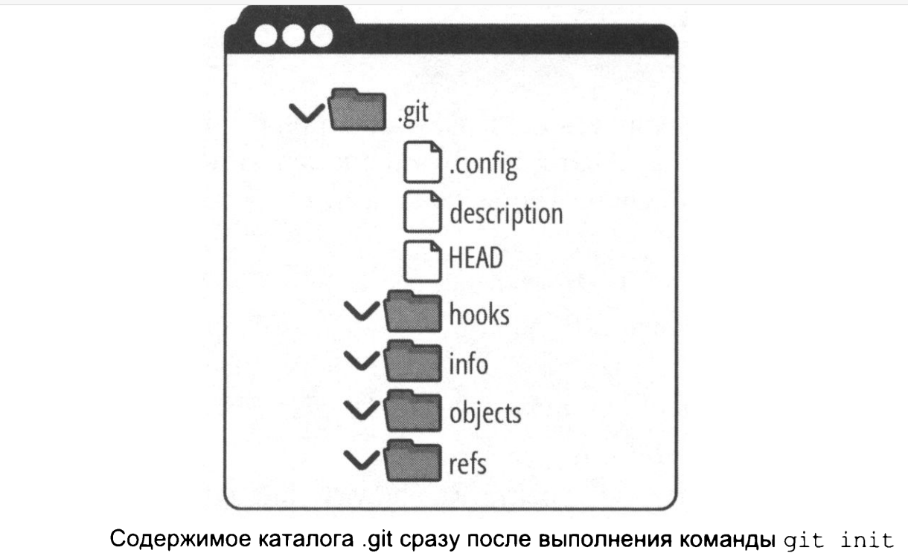
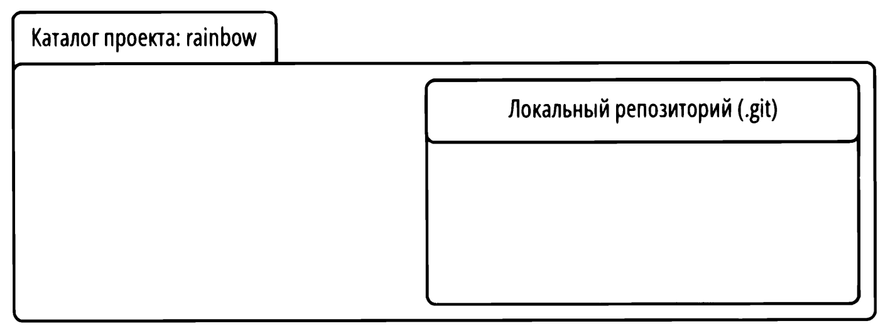
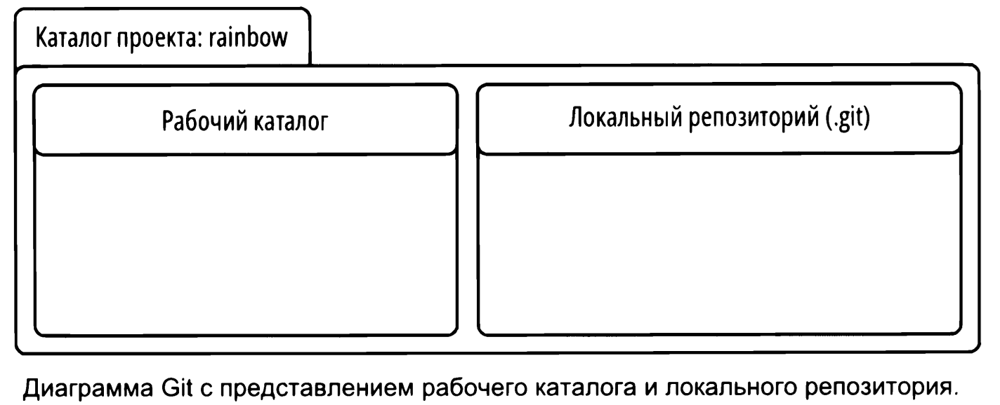
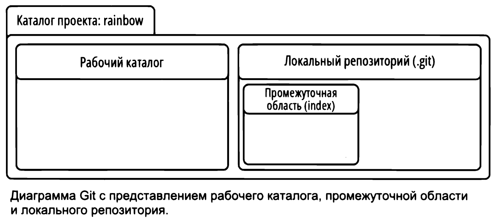
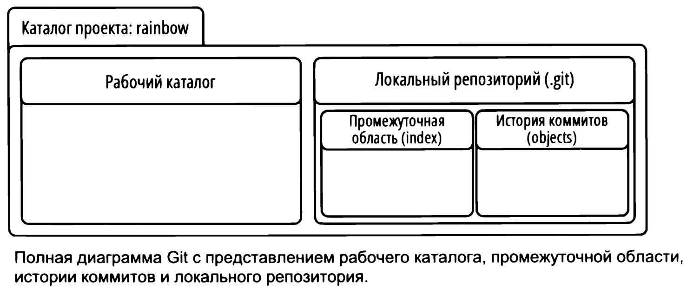

# Локальные репозитории
## git init - инициализация локального репозитория
<br>

Находясь в директории, которую мы хотим инициализировать как локальный репозиторий нужно использовать команду ```git init```.  
После чего в папке появится директория ```.git```.  
<br>
Убедимся, что в нашей директории ничего нет.  

```bash
user@WIN-CVKT899RCS2 MINGW64 ~/desktop/rainbow
$ ls -a    # вернуть содержимо директории, в том числе скрытое (-а)
./  ../    # директория пуста
```
<br>
Инициализируем директорию как локальный репозиторий и снвоа првоерим содержимое.  

```bash
user@WIN-CVKT899RCS2 MINGW64 ~/desktop/rainbow
$ git init      # инициализируем локальный репозиторий и получаем сообщение об успешном выполнении 
Initialized empty Git repository in C:/Users/user/Desktop/rainbow/.git/

user@WIN-CVKT899RCS2 MINGW64 ~/desktop/rainbow (master)
$ ls -a         # появилась директория .git, что говорит о наличии локального репозитория (скрыт)
./  ../  .git/

```
<br>
Посмотрим на содержимое созданной директории .git

```bash
user@WIN-CVKT899RCS2 MINGW64 ~/desktop/rainbow (master)
$ cd .git    # отправляемся в директории локального репозитория

user@WIN-CVKT899RCS2 MINGW64 ~/desktop/rainbow/.git (GIT_DIR!)
$ ls -a      # смотрим на его содержимое
./  ../  HEAD  config  description  hooks/  info/  objects/  refs/

```
<br>

Так содержимое репозитория выглядит в VS Code
```
Mode                 LastWriteTime         Length Name
----                 -------------         ------ ----
d-----        16.11.2024     23:16                hooks
d-----        16.11.2024     23:16                info
d-----        16.11.2024     23:16                objects
d-----        16.11.2024     23:16                refs
-a----        16.11.2024     23:16            130 config
-a----        16.11.2024     23:16             73 description
-a----        16.11.2024     23:16             23 HEAD
```
<br>

Содержимое созданного локального репозитория в виде схемы.  
  
<br>

Если представить локальный репозиторий в виде диаграммы.  
   

---
## Области git
### Рабочий каталог
Место для хранения файлов и каталогов, представляющую одну версию проекта.  Для того чтобы понять как происходит управление файлами проекта в рабочем каталоге взглянем на диаграмму.  Иными словами - это место, где мы вносим иземения в содержимое проекта.
<br>  

   
<br>  

### Прмоежуточная область
```index```
Промежуточная область или индекс чем-то напоминает черновик. Здесь можно добавлять или удалять файлы перед включением их в следующую версию проекта. Промежуточнаяо бласть предсталена файлом ```index``` в каталоге ```.git```
<br>  

   
<br>

### Коммит
Коммит это просто одна версия проекта, как его снимок. У каждого коммита есть *хеш* (идентификатор коммита) - 40-ка символьный код, выступающий в роли имени коммита и позволяет на него ссылаться.
<br>

### История коммитов
```objects```
Место, где хранится история существующих коммитов. Представлена каталогом ```ojects``` в директории ```.git```.  Каждый раз раз когда мы делаем новый коммит, он сохраняется в истории.
```bash
user@WIN-CVKT899RCS2 MINGW64 ~
$ cd desktop/rainbow/.git      # отправляемся в папку локального репозитория

user@WIN-CVKT899RCS2 MINGW64 ~/desktop/rainbow/.git (GIT_DIR!)
$ ls -a                        # возвращаем содержимое и видим object
./  ../  HEAD  config  description  hooks/  info/  objects/  refs/
```
<br>  

 
<br> 

диаграмма, содержащая основные объекты git готова. Теперь можем загрузить первый файл в проект. Объекта index нет, т.к. нет версий проекта.

---
## Загрузка файла в проект
