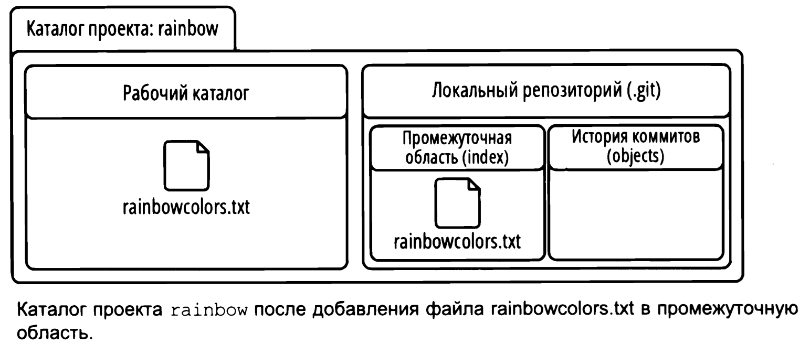
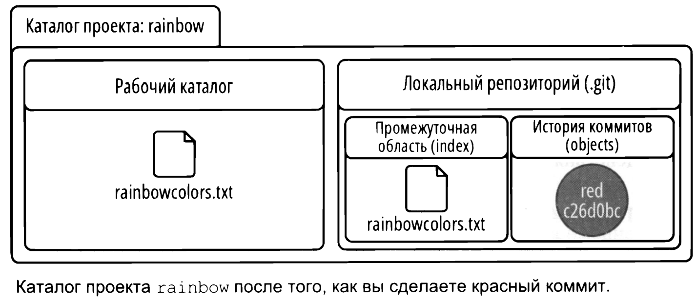

# Локальные репозитории
## git init - инициализация локального репозитория
<br>

Находясь в директории, которую мы хотим инициализировать как локальный репозиторий нужно использовать команду ```git init```.  
После чего в папке появится директория ```.git```.  
<br>
Убедимся, что в нашей директории ничего нет.  

```bash
user@WIN-CVKT899RCS2 MINGW64 ~/desktop/rainbow
$ ls -a    # вернуть содержимо директории, в том числе скрытое (-а)
./  ../    # директория пуста
```
<br>
Инициализируем директорию как локальный репозиторий и снвоа првоерим содержимое.  

```bash
user@WIN-CVKT899RCS2 MINGW64 ~/desktop/rainbow
$ git init      # инициализируем локальный репозиторий и получаем сообщение об успешном выполнении 
Initialized empty Git repository in C:/Users/user/Desktop/rainbow/.git/

user@WIN-CVKT899RCS2 MINGW64 ~/desktop/rainbow (master)
$ ls -a         # появилась директория .git, что говорит о наличии локального репозитория (скрыт)
./  ../  .git/

```
<br>
Посмотрим на содержимое созданной директории .git

```bash
user@WIN-CVKT899RCS2 MINGW64 ~/desktop/rainbow (master)
$ cd .git    # отправляемся в директории локального репозитория

user@WIN-CVKT899RCS2 MINGW64 ~/desktop/rainbow/.git (GIT_DIR!)
$ ls -a      # смотрим на его содержимое
./  ../  HEAD  config  description  hooks/  info/  objects/  refs/

```
<br>

Так содержимое репозитория выглядит в VS Code
```
Mode                 LastWriteTime         Length Name
----                 -------------         ------ ----
d-----        16.11.2024     23:16                hooks
d-----        16.11.2024     23:16                info
d-----        16.11.2024     23:16                objects
d-----        16.11.2024     23:16                refs
-a----        16.11.2024     23:16            130 config
-a----        16.11.2024     23:16             73 description
-a----        16.11.2024     23:16             23 HEAD
```
<br>

Содержимое созданного локального репозитория в виде схемы.  
  
<br>

Если представить локальный репозиторий в виде диаграммы.  
   

---
## Области git
### Рабочий каталог
Место для хранения файлов и каталогов, представляющую одну версию проекта.  Для того чтобы понять как происходит управление файлами проекта в рабочем каталоге взглянем на диаграмму.  Иными словами - это место, где мы вносим иземения в содержимое проекта.
<br>  

   
<br>  

### Прмоежуточная область
```index```
Промежуточная область или индекс чем-то напоминает черновик. Здесь можно добавлять или удалять файлы перед включением их в следующую версию проекта. Промежуточнаяо бласть предсталена файлом ```index``` в каталоге ```.git```
<br>  

   
<br>

### Коммит
Коммит это просто одна версия проекта, как его снимок. У каждого коммита есть *хеш* (идентификатор коммита) - 40-ка символьный код, выступающий в роли имени коммита и позволяет на него ссылаться.
<br>

### История коммитов
```objects```
Место, где хранится история существующих коммитов. Представлена каталогом ```ojects``` в директории ```.git```.  Каждый раз раз когда мы делаем новый коммит, он сохраняется в истории.
```bash
user@WIN-CVKT899RCS2 MINGW64 ~
$ cd desktop/rainbow/.git      # отправляемся в папку локального репозитория

user@WIN-CVKT899RCS2 MINGW64 ~/desktop/rainbow/.git (GIT_DIR!)
$ ls -a                        # возвращаем содержимое и видим object
./  ../  HEAD  config  description  hooks/  info/  objects/  refs/
```
<br>  

 
<br> 

Диаграмма, содержащая основные объекты git готова. Теперь можем загрузить первый файл в проект. Объекта index нет, т.к. нет версий проекта.

---
## Загрузка файла в проект

```bash
user@WIN-CVKT899RCS2 MINGW64 ~
$ cd desktop/rainbow          # отправляемся в директорию проекта

user@WIN-CVKT899RCS2 MINGW64 ~/desktop/rainbow (master)
$ touch rainbowcolors.txt     # создаем файл для загрузки
```
<br> 

```rainbowcolors.txt``` - хрантися в директории ```rainbow```, следовательно он находится в рабочем каталоге.   
```rainbowcolors.txt``` - не является частью репозитория т.к. не был добавлен в промещуточную область ```index``` и не был включен в историю коммитов ```obects```.  
<br>  

 
<br> 

```rainbowcolors.txt``` поскольку файла нет еще в репозитории, файл является неотслеживаемым (untracked file).Каждый нвоый файл должен быть включен явно добавлен в промежуточную область ```index```, а затем включен в проект, чтобы стать отслеживаемым файлом. 


---
## Первый коммит
Коммит состоит из двух действий:
1) добавьте все файлы, которые нужно включить в коммит в промежуточную область ```index```;
2) выполните коммит с сопровождающей записью пояснением.
<br>

Здесь нам пригодится команда ```git status```, которая позволит понять, какие файлы в рабочем каталоге а какие добавлены в промежуточную область.  
<br>  

```bash
user@WIN-CVKT899RCS2 MINGW64 ~
$ cd desktop/rainbow    # отправляемся в директорию проекта

user@WIN-CVKT899RCS2 MINGW64 ~/desktop/rainbow (master)
$ git status            # запрашиваем информацию о состоянии рабочего каталога и промежуточной области
On branch master        # ответ - текущая ветка

No commits yet          # ответ - коммитов пока нет

Untracked files:        # ответ - неотслеживаемый файлы
  (use "git add <file>..." to include in what will be committed)
        rainbowcolors.txt

nothing added to commit but untracked files present (use "git add" to track)  # в коммит ничего не добавлено но есть неотлсеживаемая информация
```
<br>

Расшифровка ответа на команду ```git status```  
* коммитов еще нет, история коммитов ```objects``` не содержит записей;    
* rainbowcolors.txt является неотслеживаемым;  
* git дает инструкции для добавлении файла в отслеживаемую область ```git add <file?```.
<br>

### Добавление файла в промежуточную область (index)

Добавить файл в промежуточную область можно командой ```git add <file>```. Если нужно выбрать конкретные файлы, передайвайте команде имя или список имен. Если добавить нужно весь каталог то используйте ```git add -a``` (*a - all*).  
Это может быть очень удобно при работе со множеством файлов. Например, есть список файлов:
* file_1;
* file_2;
* file_3.
Прелположим, что я редактировал только 1 и 3 файлы, и хотел бы их сохранить. Тогда в коммит я включу только 1 и 3, для этого через ```git add file_1 file_2``` должен поместить их в промежуточную область.
<br>

```bash
user@WIN-CVKT899RCS2 MINGW64 ~/desktop/rainbow (master)
$ pwd                        # уточняем свое местоположение,  убеждаемся, что мы в директории проекта 
/c/Users/user/desktop/rainbow

user@WIN-CVKT899RCS2 MINGW64 ~/desktop/rainbow (master)
$ git add rainbowcolors.txt  # добавляем в промежуточную область наш текстовый файл

user@WIN-CVKT899RCS2 MINGW64 ~/desktop/rainbow (master)
$ git status                 # запрашиваем информацию о состоянии
On branch master             # ответ - на ветке мастер

No commits yet               # коммитов пока нет

Changes to be committed:     # изменения включенные в коммит, файл включен в промежуточную область
  (use "git rm --cached <file>..." to unstage)
        new file:   rainbowcolors.txt
```
<br>  

Теперь мы можем посмотреть список файлов директории ```.git``` и убедиться, что с помещением в промежуточную область файлов в директории создается объект ```index```.  

```bash
user@WIN-CVKT899RCS2 MINGW64 ~/desktop/rainbow (master)
$ cd .git    # отправляеся в директорию .git

user@WIN-CVKT899RCS2 MINGW64 ~/desktop/rainbow/.git (GIT_DIR!)
$ ls -a      # запрашиваем содержимое и видим новый объект, index
./  ../  HEAD  config  description  hooks/  index  info/  objects/  refs/
```
<br>  

 
<br> 
на диаграмме видно, что наш файл теперь находится как в рабочем каталоге так и в промежуточной области. ```git add``` не перемещает файл в прмоежуточную область ```index``` - он копирует туда файл из рабочего каталога. 
<br>

### Коммит
Для выполнения коммита выпользуемся командой ```git commit -m "текст сообщения"``` (m - message).  
<br>  

```bash
user@WIN-CVKT899RCS2 MINGW64 ~/desktop/rainbow (master)
$ git commit -m "red color"
[master (root-commit) 8702e14] red color  # в выводе представлены первые 7 символов хеша коммита
 1 file changed, 1 insertion(+)
 create mode 100644 rainbowcolors.txt
```
<br>  

 
<br> 

