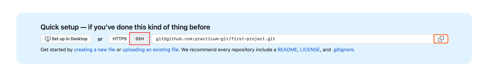
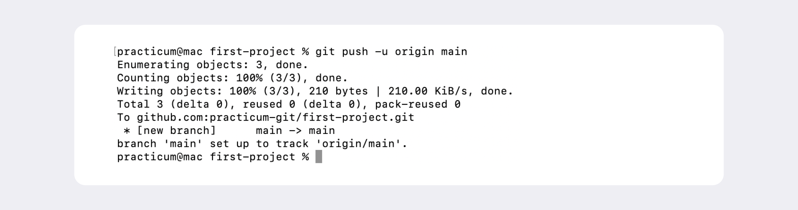

# Синхронизация репозиториев


## Что такое SSH  
---

**(от англ. Secure Shell Protocol)** С помощью этого протокола можно получать данные с удалённого компьютера или отправлять их на него. Трафик шифруется, поэтому протокол безопасен.  

SSH использует пару ключей для обеспечения безопасности — публичный и приватный:   
* **Приватный ключ** (англ. private key) хранится только на вашем компьютере и не должен передаваться кому-либо ещё. Он используется для расшифровки данных.  
* **Публичный ключ** (англ. public key) доступен всем и используется для шифрования данных. Они могут быть расшифрованы парным приватным ключом.

### Проверка наличия SSH
---

```bash
user@WIN-CVKT899RCS2 MINGW64 ~ -- домашняя директория
$ ls -la .ssh
total 35
drwxr-xr-x 1 user 197121   0 Nov 28 21:59 ./
drwxr-xr-x 1 user 197121   0 Apr  8 20:22 ../
-rw-r--r-- 1 user 197121 411 Jan  1 21:00 id_ed25519
-rw-r--r-- 1 user 197121 102 Jan  1 21:00 id_ed25519.pub
-rw-r--r-- 1 user 197121 828 Nov 28 21:59 known_hosts
-rw-r--r-- 1 user 197121  92 Nov 28 21:59 known_hosts.old
```

Если есть файлы с похожими названиями, SSH-ключи уже создавались:  
* ```id_dsa.pub```;   
* ```id_ecdsa.pub```;  
* ```id_ed25519.pub```;  
* ```id_rsa.pub```. 

### Инструкция по генерации SSH-ключа
---

1) Для генерации SSH-пары откройте терминал и введите 
```bash
$ ssh-keygen -t ed25519 -C "электронная почта, к которой привязан ваш аккаунт на GitHub"
```

в случае поулчения ошибки из-за отсуствия поддержки системой шифрования ed25519 можно использовать другой.  

```bash
$ ssh-keygen -t rsa -b 4096 -C "электронная почта, к которой привязан ваш аккаунт на GitHub"
```

Если все ок, видим такую надпись:  
```bash
> Generating public/private rsa key pair. # сгенерированы публичный и приватный ключи
```

2) Укажите место хранения ключей  
```bash
> Enter a file in which to save the key (C:\Users\<имя_пользователя>\.ssh\):[Press enter]
```  
Теперь в указанной директории появится пара ключей  

3) Программа запросит кодовую фразу (англ. passphrase) для доступа к SSH-ключу. Вы можете оставить поле пустым. Для этого нажмите Enter, а затем ещё раз Enter для подтверждения.  
```bash
> Enter passphrase (empty for no passphrase): [Type a passphrase]
> Enter same passphrase again: [Type passphrase again]
```

4) Готово! Теперь осталось проверить, что ключи действительно сгенерировались. Для этого вызовите эту команду.  
```bash
ls -a ~/.ssh
```
 На экране должны появиться два файла — один с расширением ```.pub```, другой — без. Файл в ```.pub``` — публичный, им можно делиться с веб-сайтами или коллегами. Файл без расширения ```.pub``` — приватный. 

## Привязываем SSH-ключ к GitHub  
---

 1) После выполнения команды ssh-keygen в директории ~/.ssh будет создано два файла — id_ed25519 и id_ed25519.pub (или id_rsa и id_rsa.pub — в зависимости от алгоритма):  
* id_ed25519/id_rsa — приватный ключ (файл без .pub в конце). 
* id_ed25519.pub/id_rsa.pub — публичный ключ (на это указывает расширение .pub).  

```bash
user@WIN-CVKT899RCS2 MINGW64 ~
$ ls -la .ssh 
total 35
-rw-r--r-- 1 user 197121 411 Jan  1 21:00 id_ed25519
-rw-r--r-- 1 user 197121 102 Jan  1 21:00 id_ed25519.pub   # проверяем наличие публичного ключа в директории .ssh
```

2) копируем публичный ключ и добавляем его в git в соответсвующем разделе настроек учетной записи
```bash
user@WIN-CVKT899RCS2 MINGW64 ~
$ cat ~/.ssh/id_ed25519.pub
ssh-ed25519 AAAAC3NzxC1lZDx1NTE5AAAAIOc3CxzyJNxheIwnGfhqxcPrqy0xt6p5XxT2dLCfdY5o user@WIN-CVKT899RCS2
```
3) проверяем правильность ввода ключа
```bash
user@WIN-CVKT899RCS2 MINGW64 ~
$ ssh -T git@github.com
Hi user! You've successfully authenticated, but GitHub does not provide shell access. # SSH-ключ, который ты используешь, прошёл проверку.
```
`$ ssh -T git@github.com`  
Это команда, которая делает следующее:  
* `ssh` — это утилита для безопасного удалённого подключения к серверу.  
* `-T` — отключает возможность получения shell (оболочки) на сервере.  
* `git@github.com` — это указание, что мы подключаемся к серверу GitHub как пользователь git.  

## Связываем локальный и удалённый репозитории  
---

Привязать удалённый репозиторий к локальному — `git remote add`  

Перейдите на страницу удалённого репозитория, выберите тип SSH и скопируйте URL. Кнопка справа позволит сделать это мгновенно.

```bash
$ cd ~/dev/first-project -- отправляемся в папку с репозиторием
$ git remote add origin git@github.com:%ИМЯ_АККАУНТА%/first-project.git
```
Команде необходимо передать два параметра. Имя удалённого репозитория и его URL:  
* В качестве имени используйте слово `origin`.  
* URL вы скопировали со страницы удалённого репозитория.  

### Вывести список подключений
---

```bash
$ git remote -v
origin  https://github.com/%ИМЯ_АККАУНТА%/%ИМЯ-ПРОЕКТА%.git (fetch)
origin  https://github.com/%ИМЯ_АККАУНТА%/%ИМЯ-ПРОЕКТА%.git (push)
```
Отлично, локальны и удаленный репозиторий связаны!

## Синхронизируем локальный и удалённый репозитории
---

### Ветки
---
Если коммит это снимок то ветка это временная линия. В репозитории одновременно могут существовать несколько параллельных веток. Самая первая вета может называться `main` или `master`.  

### Отправить изменения в репозиторий Git  
---

Полный цикл это: 
1) подготовить файлы `git add`;
2) закоммитить с добавлением комменатрия `git commit -m`;  
3) загрузить содержимое в удаленный репозиторий `git push`.  
  
В первый раз эту команду нужно вызвать с флагом `-u` и параметрами `origin` (имя удалённого репозитория) и `main` или `master` (название текущей ветки). Флаг `-u` свяжет локальную ветку с одноимённой удалённой.  
```bash
$ git push -u origin main # Если команда приведёт к ошибке, попробуйте 
                          # заменить main на master.
```
Получим такое сообщение  
